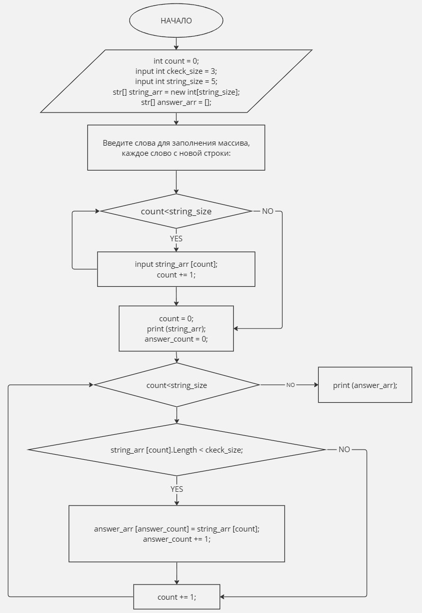

## Задача:
Написать программу, которая из имеющегося массива строк формирует новый массив из строк, длина которых меньше, либо равна 3 символам. Первоначальный массив можно ввести с клавиатуры, либо задать на старте выполнения алгоритма. При решении не рекомендуется пользоваться коллекциями, лучше обойтись исключительно массивами.

## Решение:
1. Задаем переменные связанные с количеством символов элементов, которые должны сформировать новый массив.
2. Формируем массив исходных данных.
3. Проверяем каждый элемент массива на соответствиеусловию задачи, при его соблюдении записываем элемент в новый массив.
4. Выводим массив искомых значений для проверки.

